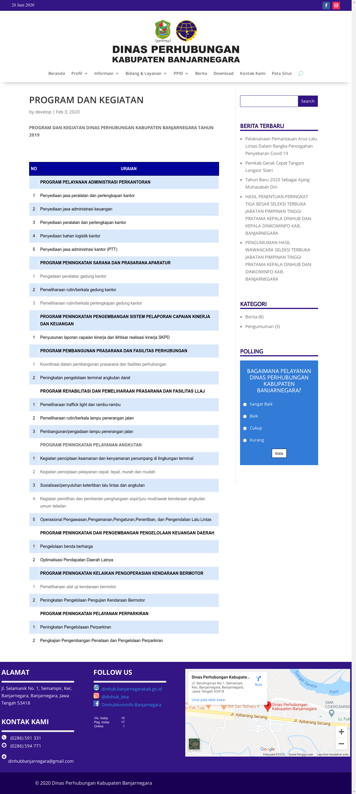

# Sistem-Uji-KIR-Dinhub-Banjarnegara
Sistem Pendaftaran Uji KIR (Kelayakan Kendaraan) Dinas Perhubungan Kabupaten Banjarnegara merupakan sebuah project yang dibuat untuk kepentingan PKL (Praktik Kerja Lapangan) pada tahun 2020. Sistem ini dibangun dengan bahasa pemrograman PHP, database MySQL, dan Framework Bootstrap.

## About the Project
Project **Sistem Pendaftaran Uji KIR Dinhub Banjarnegara** merupakan bagian dari sebuah **sistem website Dinas Perhubungan Kab. Banjarnegara**. Project ini dibuat dalam rangka magang/ *internship* Praktik Kerja Lapangan (PKL) di Dinas Komunikasi dan Informatika (Dinkominfo) Kab. Banjarnegara pada tahun 2020. Sistem website Dinas Perhubungan Kab. Banjarnegara sendiri terdiri dari: **`Website utama Dinas Perhubungan Kab. Banjarnegara`** & **`Sistem Pendaftaran Uji KIR Dinas Perhubungan Kab. Banjarnegara`**. Untuk *source code* dari website utama Dinas Perhubungan Kab. Banjarnegara, tidak kami share di repositori ini, namun website-nya dapat dilihat pada [https://dinhub.banjarnegarakab.go.id](https://dinhub.banjarnegarakab.go.id). Sedangkan *source code* yang tersedia pada repositori ini adalah *source code* dari Sistem Pendaftaran Uji KIR Dinhub Banjarnegara.

## Tech Stack

* **Website Utama** Dinas Perhubungan Kabupaten Banjarnegara: **CMS Wordpress** + **DIVI** (Theme Plugin)
* **Sistem Pendaftaran Uji KIR** Dinas Perhubungan Kabupaten Banjarnegara: **LAMP** (Linux, Apache, MySQL, PHP)

## Mockup Preview

## Screenshots
* **Website Utama Dinas Perhubungan Kabupaten Banjarnegara**

  Homepage | Example Pages
  :-------------------------:|:-------------------------:
    |  
  Search Result Example | Example Posts
    |  

* **Sistem Pendaftaran Uji KIR Dinas Perhubungan Kabupaten Banjarnegara**

  Dashboard User | Login Admin
  :-------------------------:|:-------------------------:
    |  
  Dashboard Admin | Tambah Jadwal Uji KIR
    |  
  Edit Entri Uji KIR
  

## Live Website Link
Website Dinas Perhubungan Kabupaten Banjarnegara: [https://dinhub.banjarnegarakab.go.id/](https://dinhub.banjarnegarakab.go.id/)

## Features
* **Website Utama Dinas Perhubungan Kabupaten Banjarnegara**
  * Add & Edit Posts
  * Add & Edit Pages
  * View Posts
  * View Pages
  * Perform Search Query
  
* **Sistem Pendaftaran Uji KIR Dinas Perhubungan Kabupaten Banjarnegara**
  * Add Entry Jadwal Uji KIR
  * Update Entry Jadwal Uji KIR
  * Delete Entry Jadwal Uji KIR
  * Manage Jadwal Uji KIR
  * Login & Logout (for Admin)

## Technology Used
* CMS Wordpress
* DIVI (Theme Plugin)
* Bootstrap (CSS Framework)
* PHP
* MySQL (phpMyAdmin)
* SB Admin 2 (from Bootstrap)

## Installation

  * Setup an **Apache Web Server** & **phpMyAdmin**
  * Upload the database [**`database.sql`**](database/database.sql) in your **phpMyAdmin** dashboard (Open **Import** tab, and upload the file there)
  * Upload all files in [**`website`**](website) folder into your web **main folder (public_html)**
  * Change database info (edit the database **host, username, and password**) on [**`config.php`**](website/config.php) & [**`admin/config.php`**](website/admin/config.php)
  * Open the website on **your-website-url.com**
  * Admin Login Page: your-website-url.com/admin (Change your-website-url.com with your own domain, if you installed it on localhost, change it to localhost)
  * Admin Account:
    * Username: admin
    * Password: password

## System Context Diagram (SCD) & Data Flow Diagram (DFD)
  System Context Diagram (SCD)_1 | System Context Diagram (SCD)_2
  :-------------------------:|:-------------------------:
   | 
  Data Flow Diagram (DFD)_1 | Data Flow Diagram (DFD)_2
   | 

## Other Information
  Google Search Result | Last 2 Months Visitors (2023)
  :-------------------------:|:-------------------------:
   | .PNG)
